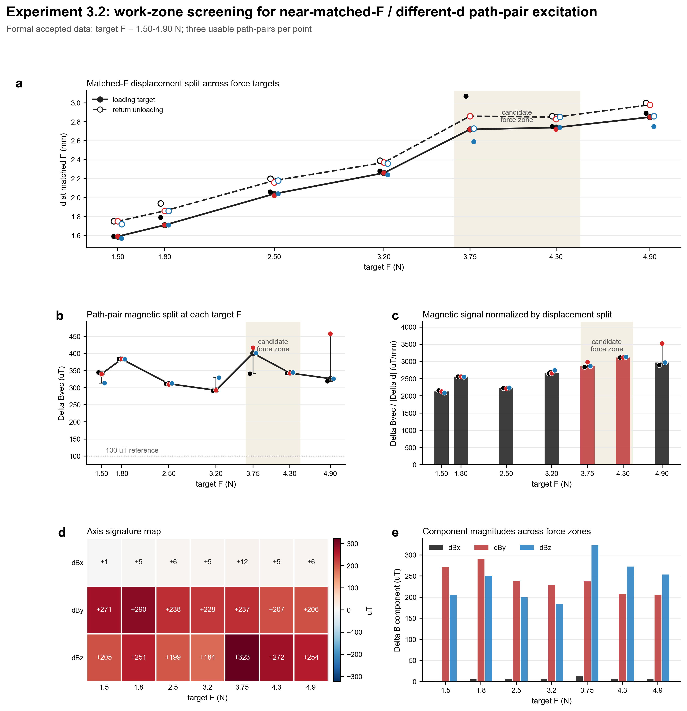
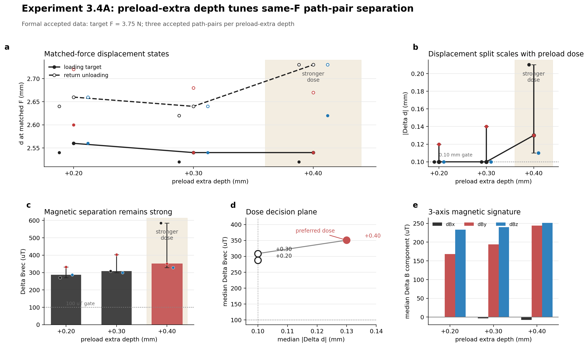
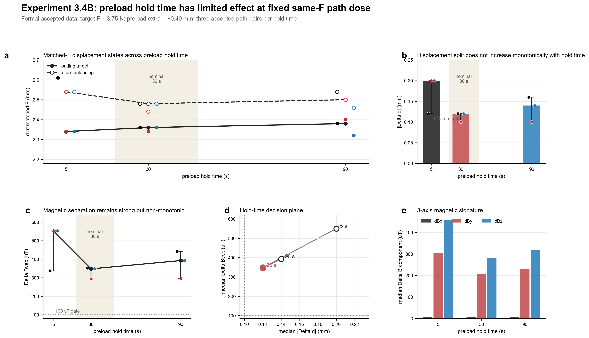
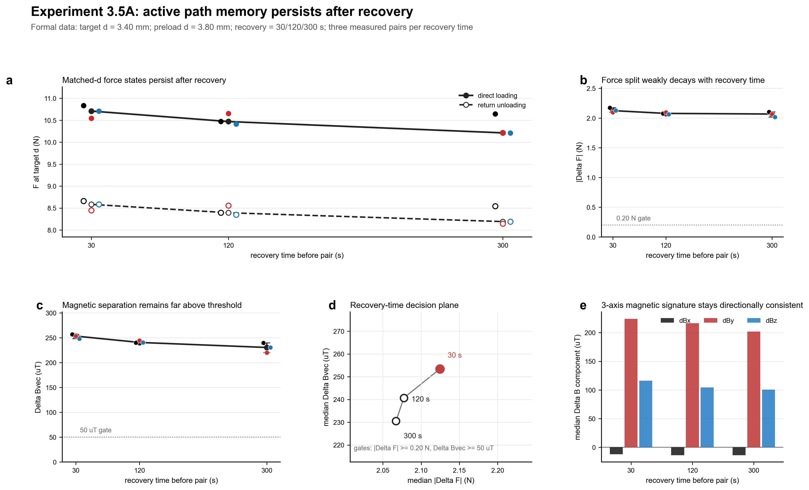
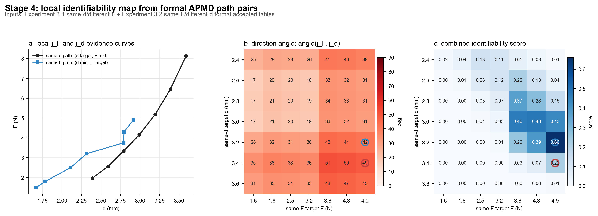
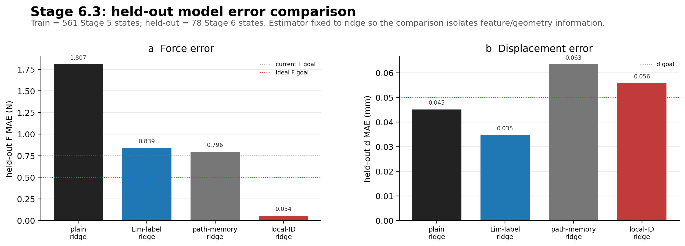
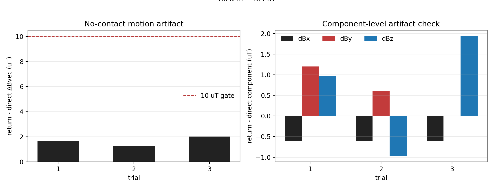
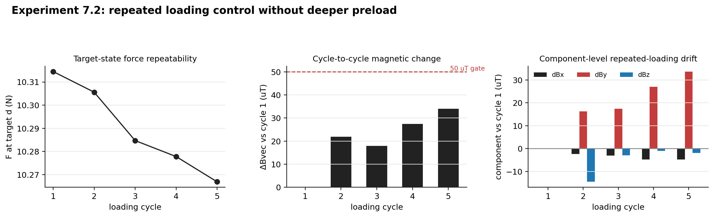

# APMD Stage 3-7 Final Evidence and Model Analysis Report

## 0. Purpose of This Report

This report consolidates the current APMD evidence chain from Stage 3 to Stage 7 and the model results from Stage 5 to Stage 6. It does not introduce new experimental decisions, modify raw data, or reclassify failed sessions. It only summarizes accepted formal data and existing model outputs.

The report addresses two questions:

1. Can active path-pair excitation convert soft-material hysteresis, preload history, and recovery effects from uncontrolled error sources into controlled and identifiable excitation sources?
2. Does the local magnetic response geometry measured from active path pairs improve force-displacement decoupling beyond plain magnetic regression and simple loading/unloading branch-label compensation?

The main conclusion is bounded but clear: in the current bench-top magnetic tactile setup, APMD provides a coherent local mechanism and modeling evidence chain. Stage 3 shows strong magnetic separation under controlled active path pairs. Stage 4 converts this phenomenon into local `j_F/j_d` sensitivity geometry. Stage 5-6 show that the local geometry improves held-out decoupling. Stage 7 rules out two major alternative explanations: no-contact motion artifact and simple repeated loading.

This conclusion should not be overstated. The present evidence supports local bench-top mechanism validation, not full-range prosthetic-socket deployment.

---

## 1. Terminology and Argument Logic

| Term | Meaning in this report | Why it matters |
|---|---|---|
| APMD | Active Path-Pair Magnetic Decoupling | Core project concept |
| same-d/different-F | Active path pair recorded at nearly matched displacement but different force | Used to estimate the force-related magnetic direction `j_F` |
| same-F/different-d | Active path pair recorded at nearly matched force but different displacement | Used to estimate the displacement-related magnetic direction `j_d` |
| path-dose | Controlled change in preload depth, preload extra depth, dwell time, or recovery time | Tests whether the path excitation is controllable |
| `j_F` | Local force-related magnetic sensitivity direction estimated from same-d/different-F pairs | Key input for Stage 4 and Stage 6.3 |
| `j_d` | Local displacement-related magnetic sensitivity direction estimated from same-F/different-d pairs | Key input for Stage 4 and Stage 6.3 |
| held-out session | A complete session excluded from training and used only for testing | Tests generalization beyond memorized training states |
| Lim-style branch label baseline | A compensation model using branch labels such as loading, unloading, and preload | Represents a literature-style hysteresis-label baseline |
| local-identifiability model | A model that includes `j_F/j_d` projection coordinates and local work-zone information | Tests whether APMD adds usable local response geometry, not only labels |

The Results narrative follows six linked claims:

1. **Active path pairs create distinguishable states.** same-d/different-F and same-F/different-d experiments each control one variable and separate the other.
2. **Path excitation is controllable.** Preload depth and preload extra depth modulate the magnetic response strength.
3. **Path memory persists.** The active path-pair response remains strong after recovery times up to 300 s.
4. **Local response directions are separable.** Stage 4 shows that `j_F` and `j_d` are not collinear in a selected local work zone.
5. **Local geometry improves decoupling.** Stage 6.3 shows that local-identifiability features outperform plain magnetic and branch-label baselines.
6. **Controls rule out alternative explanations.** Stage 7 rules out no-contact motion artifact and simple repeated loading as sufficient explanations.

---

## 2. Final Stage 3-7 Evidence Figure Set

### Figure Group 1: Stage 3.1 Same-d/Different-F Work-Zone Scan

**Figure purpose.**  
This figure should show that direct-loading and return-unloading states can produce different forces at the same target displacement, and that the force split corresponds to a strong magnetic split.

**Data/session source.**

- `session_20260610_091145`: Stage 3.1A, target `d = 2.40/2.60/2.80 mm`.
- `session_20260610_104017`: Stage 3.1B, target `d = 3.00/3.20/3.40/3.60 mm`.
- Data tables:
  - `reports/experiment_3_1_complete_figure_data_summary.csv`
  - `reports/experiment_3_1_complete_figure_data_replicates.csv`
  - `reports/experiment_3_1_complete_figure_data.md`
- A final Stage 3.1 PNG was not found in `reports`, so this figure set should be described as data-backed and generated from the listed tables.

**What to look at.**

1. Whether direct-loading and return-unloading states satisfy the same-d gate.
2. Whether force separates at the same target displacement.
3. Whether `Delta Bvec` increases from shallow to deeper work zones.
4. Whether `d = 3.20-3.40 mm` forms a practical local work zone.

**Key quantitative result.**

| target d (mm) | median abs(Delta F) (N) | median Delta Bvec (uT) | verdict |
|---:|---:|---:|---|
| 2.40 | 0.432 | 62.8 | strong |
| 2.60 | 0.515 | 110.2 | strong |
| 2.80 | 0.698 | 103.4 | strong |
| 3.00 | 0.814 | 155.4 | strong |
| 3.20 | 0.973 | 200.6 | strong |
| 3.40 | 1.183 | 227.8 | strong |
| 3.60 | 1.587 | 207.3 | strong |

All `21/21` path pairs passed the same-d and strong magnetic gates.

**Interpretation.**  
This experiment provides the first control-variable evidence for APMD. At nearly identical displacement, changing the prior path history creates different force states and different magnetic states. The magnetic split is not only a mechanical force-sensor observation; it appears directly in the three-axis magnetic signal.

**Claim supported.**  
Active path-pair excitation can create a force-related magnetic response at controlled displacement.

**Limitation/boundary.**  
This is mechanism evidence, not a complete model-training dataset. It supports same-d separability, but does not by itself prove same-F separability or prediction accuracy.

---

### Figure Group 2: Stage 3.2 Same-F/Different-d Work-Zone Scan

**Figure purpose.**  
This figure should show that loading and return-unloading paths can create different displacement states at nearly matched force, with strong magnetic separation.

**Data/session source.**

- Main figure: `reports/experiment_3_2_style31_complete_abcde.png`
- Data table: `reports/experiment_3_2_same_f_different_d_figure_data_replicates.csv`
- Accepted formal target forces: `1.50/1.80/2.50/3.20/3.75/4.30/4.90 N`
- `5.50 N` was not required for this formal round.

**What to look at.**

1. Whether force matching stays inside the same-F gate.
2. Whether loading and return-unloading displacement states separate.
3. Whether `Delta Bvec` remains strong across target forces.
4. Whether the response is dominated by `dBy` and `dBz`.

**Key quantitative result.**

- Formal accepted force points cover `1.50-4.90 N`.
- Each accepted target force has three usable path pairs.
- Typical displacement split is approximately `0.11-0.16 mm`.
- `Delta Bvec` remains in the approximate `313-458 uT` range.
- The three-axis response is dominated by `dBy` and `dBz`, while `dBx` is relatively small.

**Interpretation.**  
Stage 3.2 complements Stage 3.1. Stage 3.1 shows force separability under matched displacement; Stage 3.2 shows displacement separability under matched force. Together, they show that APMD can construct magnetic response differences along both force-related and displacement-related directions.

**Claim supported.**  
Active path-pair excitation can create a displacement-related magnetic response at controlled force.

**Limitation/boundary.**  
The same-F experiment is sensitive to force matching. Only accepted reps and formal composite records are used as evidence; failed or bad-match sessions are not included.

---

### Figure Group 3: Stage 3.3-3.5 Path-Dose and Recovery Figures

**Figure purpose.**  
These figures show that the active path-pair response is controllable through path-dose variables and that path memory persists after recovery.

**Data/session source.**

- Stage 3.3A same-d preload depth: `session_20260612_155336`
- Stage 3.3B same-d preload hold time: `session_20260612_180059`
- Stage 3.4A same-F preload extra depth:
  - `reports/experiment_3_4A_same_f_path_dosage_complete.png`
  - `reports/experiment_3_4A_same_f_path_dosage_summary.csv`
  - `reports/experiment_3_4A_same_f_path_dosage_replicates.csv`
- Stage 3.4B same-F preload hold time:
  - `reports/experiment_3_4B_same_f_path_hold_time_complete.png`
  - `reports/experiment_3_4B_same_f_path_hold_time_summary.csv`
  - `reports/experiment_3_4B_same_f_path_hold_time_replicates.csv`
- Stage 3.5 recovery time:
  - `session_20260614_201905`
  - `reports/experiment_3_5A_recovery_time_path_memory_complete.png`
  - `reports/experiment_3_5A_recovery_time_path_memory_summary.csv`
  - `reports/experiment_3_5A_recovery_time_path_memory_replicates.csv`

**What to look at.**

1. Whether deeper preload increases `Delta Bvec`.
2. Whether longer dwell time provides comparable strengthening.
3. Whether the response remains after longer recovery times.
4. Whether same-d and same-F dose experiments support the same interpretation.

**Key quantitative result.**

Same-d preload depth at target `d = 3.40 mm`:

| preload d (mm) | mean abs(Delta F) (N) | mean Delta Bvec (uT) |
|---:|---:|---:|
| 3.60 | 1.004 | 166.3 |
| 3.70 | 1.284 | 205.8 |
| 3.80 | 1.519 | 242.6 |

Same-d preload hold time at target `d = 3.40 mm`, preload `d = 3.80 mm`:

| hold time (s) | mean abs(Delta F) (N) | mean Delta Bvec (uT) |
|---:|---:|---:|
| 5 | 1.527 | 251.1 |
| 30 | 1.590 | 236.9 |
| 90 | 1.623 | 241.1 |

Same-F preload extra depth at `F = 3.75 N`:

| preload extra (mm) | median abs(Delta d) (mm) | median Delta Bvec (uT) |
|---:|---:|---:|
| 0.20 | 0.10 | 287.6 |
| 0.30 | 0.10 | 308.8 |
| 0.40 | 0.13 | 350.8 |

Same-F hold time at `F = 3.75 N`, preload extra `+0.40 mm`:

| hold time (s) | median abs(Delta d) (mm) | median Delta Bvec (uT) |
|---:|---:|---:|
| 5 | 0.20 | 550.1 |
| 30 | 0.12 | 347.8 |
| 90 | 0.14 | 392.5 |

Recovery time at target `d = 3.40 mm`, preload `d = 3.80 mm`:

| recovery time (s) | median abs(Delta F) (N) | median Delta Bvec (uT) |
|---:|---:|---:|
| 30 | 2.125 | 253.4 |
| 120 | 2.077 | 240.7 |
| 300 | 2.067 | 230.5 |

**Interpretation.**  
The path-dose experiments indicate that maximum historical compression is a stronger control variable than dwell time. In both same-d and same-F modes, increasing preload depth or preload extra depth strengthens the magnetic separation. Dwell time has weaker or non-monotonic effects. Recovery time causes mild decay but does not remove the path-pair response.

**Claim supported.**  
Preload depth and preload extra depth are the main path-dose variables; path memory persists over the tested recovery window.

**Limitation/boundary.**  
The dose results are local to the current material, magnet, sensor geometry, and bench-top loading range.

---

### Figure Group 4: Stage 4 Local Identifiability Figure

**Figure purpose.**  
This figure converts the Stage 3 magnetic splits into a local identifiability question: are force-related and displacement-related magnetic response directions sufficiently separated?

**Data/session source.**

- Main figure: `reports/apmd_stage4_identifiability_complete.png`
- Report: `reports/APMD_STAGE4_IDENTIFIABILITY_ANALYSIS.md`
- Data:
  - `reports/apmd_stage4_jF_from_same_d_pairs.csv`
  - `reports/apmd_stage4_jd_from_same_f_pairs.csv`
  - `reports/apmd_stage4_identifiability_summary.csv`
  - `reports/apmd_stage4_identifiability_pair_table.csv`

**What to look at.**

1. The angle between `j_F` and `j_d`.
2. The scaled condition number.
3. The magnetic signal-to-noise ratio.
4. Whether the candidate zone lies in the stronger Stage 3 response region.

**Key quantitative result.**

- Strict primary candidate: same-d `d = 3.40 mm` paired with same-F `F = 4.90 N`.
- Angle: `48.5 deg`.
- Scaled condition number: `2.22`.
- Minimum B/noise: `22.8`.
- Practical candidate: `d = 3.20 mm / F = 4.90 N`.
- Practical angle: `41.9 deg`.

**Interpretation.**  
If force-like and displacement-like magnetic responses point in nearly the same direction, large magnetic changes are still difficult to decouple. If they point in sufficiently separated directions, the magnetic space contains two locally distinguishable coordinates. Stage 4 therefore selects zones based on both signal strength and directional separation.

**Claim supported.**  
Active path pairs provide a local identifiability basis, not merely a large magnetic signal.

**Limitation/boundary.**  
This is a local work-zone result, not a full prosthetic-socket operating range.

---

### Figure Group 5: Stage 6.3 Model Comparison Figure

**Figure purpose.**  
This figure tests whether local `j_F/j_d` geometry improves held-out force-displacement prediction beyond ordinary magnetic regression and branch-label compensation.

**Data/session source.**

- Main figure: `reports/apmd_stage6_local_identifiability_comparison.png`
- Report: `reports/APMD_STAGE6_LOCAL_IDENTIFIABILITY_MODEL.md`
- Training data: Stage 5 formal dataset, `411` states.
- Held-out data: `session_20260615_160438`, `39` states.
- Metrics: `reports/apmd_stage6_local_identifiability_model_metrics.csv`
- Predictions: `reports/apmd_stage6_local_identifiability_predictions.csv`

**What to look at.**

1. Whether plain magnetic regression performs worst.
2. Whether Lim-style branch-label compensation helps but remains limited.
3. Whether local-identifiability features reduce held-out force MAE.
4. Whether both force and displacement targets are acceptable.

**Key quantitative result.**

| model | F MAE (N) | d MAE (mm) | interpretation |
|---|---:|---:|---|
| plain magnetic ridge | 1.774 | 0.051 | weak baseline |
| Lim-style branch-label ridge | 1.096 | 0.041 | label compensation baseline |
| APMD local-ID RF | 0.128 | 0.086 | best force |
| APMD local-ID ridge | 0.286 | 0.036 | best balanced |

The local-ID ridge improves force MAE by `73.9%` relative to the Lim-style branch-label baseline.

**Interpretation.**  
This is the strongest current model-level evidence for APMD. It shows that the method is not just adding branch labels such as loading or unloading. Instead, it uses local response directions measured by active path pairs as model features.

**Claim supported.**  
The local-identifiability model outperforms both plain magnetic regression and branch-label compensation.

**Limitation/boundary.**  
The model is a local proof-of-mechanism model. It has passed held-out testing in the selected work zone, but it is not yet a full socket-range model.

---

### Figure Group 6: Stage 7 Control Figures

**Figure purpose.**  
These figures test two alternative explanations: no-contact motion artifact and simple repeated loading.

**Data/session source.**

Stage 7.1 no-contact motion artifact:

- Session: `session_20260616_152850`
- Figure: `decouple_data/session_20260616_152850/no_contact_motion_artifact.png`
- Summary: `decouple_data/session_20260616_152850/no_contact_motion_artifact_pair_summary.csv`
- B0 summary: `decouple_data/session_20260616_152850/no_contact_motion_artifact_B0_summary.csv`

Stage 7.2 repeated-loading control:

- Session: `session_20260616_170608`
- Figure: `decouple_data/session_20260616_170608/repeated_loading_control.png`
- Summary: `decouple_data/session_20260616_170608/repeated_loading_control_summary.csv`

**What to look at.**

1. Whether no-contact motion produces a magnetic split comparable to active path pairs.
2. Whether B0 drift exceeds the artifact gate.
3. Whether repeated loading without deeper preload produces strong cycle-to-cycle magnetic change.

**Key quantitative result.**

Stage 7.1:

- No-contact motion `Delta Bvec = 1.29-2.03 uT`.
- B0 drift `Delta Bvec = 3.37 uT`.
- Both remain below the `10 uT` artifact gate.

Stage 7.2:

- Repeated loading target `d = 3.40 mm`.
- Force remained near `10.27-10.31 N`.
- Maximum cycle-to-cycle `Delta Bvec = 34.1 uT`.
- This remains below the `50 uT` low-memory control gate.

**Interpretation.**  
The no-contact artifact is only about 1-2 uT, far below the active path-pair response of hundreds of uT. Repeated loading without deeper preload also fails to reproduce the active path-pair response. Therefore, the observed magnetic split is not explained by motion artifact or by repeated loading alone.

**Claim supported.**  
Stage 7 rules out two major alternative explanations for the active path-pair magnetic response.

**Limitation/boundary.**  
These controls apply to the current bench-top setup. If the sensor, sample, magnet placement, or socket-like setup changes, the controls should be repeated.

---

## 3. Results Narrative: From Phenomenon to Model

### 3.1 Active path pairs create strong magnetic separation under controlled variables

Stage 3.1 and Stage 3.2 form the core control-variable evidence for APMD. Stage 3.1 fixes displacement and changes path history to separate force. Stage 3.2 fixes force and changes path history to separate displacement.

In Stage 3.1, all `21/21` same-d path pairs were strong. As target displacement increased from `2.40 mm` to `3.60 mm`, median `|Delta F|` increased from `0.432 N` to `1.587 N`, and median `Delta Bvec` increased from `62.8 uT` to more than `200 uT` in the deeper work zone. This shows that the soft-material fact that one displacement can correspond to different forces can be converted into a measurable magnetic response.

In Stage 3.2, accepted same-F/different-d path pairs covered target forces from `1.50 N` to `4.90 N`. These data show that the complementary condition is also possible: one force level can correspond to different displacement states, again with strong magnetic separation. Together, Stages 3.1 and 3.2 provide the two local response directions needed for decoupling.

### 3.2 Preload depth and preload extra depth are the dominant path-dose variables

Stages 3.3 and 3.4 test whether the active path-pair response is controllable. If the magnetic split were random drift, changing the preload condition would not produce structured changes.

In same-d experiments at target `d = 3.40 mm`, increasing preload d from `3.60 mm` to `3.80 mm` increased mean `Delta Bvec` from `166.3 uT` to `242.6 uT`. In same-F experiments at target `F = 3.75 N`, increasing preload extra depth from `0.20 mm` to `0.40 mm` increased median `Delta Bvec` from `287.6 uT` to `350.8 uT`. These trends indicate that maximum historical compression is an important path-dose variable.

Dwell time had a weaker and less monotonic effect. In same-d hold-time tests, `Delta Bvec` stayed in the `236.9-251.1 uT` range. In same-F hold-time tests, the response did not simply increase with longer dwell. The current evidence therefore supports preload depth or extra depth as the main active path-dose variable.

### 3.3 Path memory persists during recovery

Stage 3.5 tests whether the path memory disappears after waiting. Recovery time increased from 30 s to 300 s, and median `Delta Bvec` decreased only mildly from `253.4 uT` to `230.5 uT`. All `9/9` pairs remained strong.

This result indicates that the path-pair response is not an instantaneous sampling artifact. It persists over the tested recovery window and remains strong enough to support local mechanism validation.

### 3.4 `j_F/j_d` provides a local identifiability basis

Stage 4 converts the Stage 3 phenomenon into a geometric identifiability analysis. same-d/different-F pairs define the force-related direction `j_F`; same-F/different-d pairs define the displacement-related direction `j_d`. If these two directions were collinear, force and displacement would remain difficult to separate, even with large magnetic changes.

The strict primary candidate, `d = 3.40 mm / F = 4.90 N`, reached a `48.5 deg` angle between `j_F` and `j_d`, with scaled condition number `2.22` and min B/noise `22.8`. This indicates that the selected local work zone has both sufficient signal strength and sufficient directional separation.

This is also where APMD differs from simple branch-label compensation. A branch label tells the model which branch a state belongs to. `j_F/j_d` tells the model how force-like and displacement-like changes are oriented in magnetic space.

### 3.5 Local-identifiability modeling improves held-out decoupling

Stage 5-6 moves from mechanism evidence to prediction. In Stage 5.2 grouped cross-validation, plain magnetic ridge achieved `F MAE = 1.563 N`; path-label ridge improved this to `1.332 N`; path-memory ridge further improved it to `0.827 N`. This shows that path information helps, but it does not yet prove that local `j_F/j_d` geometry is useful.

Stage 6.2 used a complete held-out session for testing. Plain magnetic ridge reached `F MAE = 1.774 N`, and Lim-style branch-label ridge improved to `1.096 N`, but force prediction remained above the original `0.50 N` target.

Stage 6.3 then added local-identifiability features derived from Stage 4. The APMD local-ID ridge achieved `F MAE = 0.286 N` and `d MAE = 0.036 mm`. Relative to the Lim-style branch-label baseline, force MAE improved by `73.9%`. This provides model-level evidence that the active path-pair geometry is more informative than branch labels alone.

### 3.6 Control experiments rule out motion artifact and simple repeated loading

Stage 7 strengthens the mechanism claim by testing alternative explanations. In Stage 7.1, no-contact motion produced only `1.29-2.03 uT` of `Delta Bvec`, and B0 drift was `3.37 uT`. These values are far below the hundreds of uT observed in active path-pair experiments.

In Stage 7.2, repeated loading to `d = 3.40 mm` without deeper preload produced a maximum cycle-to-cycle `Delta Bvec` of `34.1 uT`, below the `50 uT` control gate. Thus, repeated loading alone did not reproduce the strong active path-pair response.

Together, these controls support the interpretation that the strong magnetic separation is generated by the active preload-return path history rather than by equipment motion, environmental drift, or simple repeated loading.

---

## 4. Integrated Claim-Evidence Map

| Claim | Evidence | Status |
|---|---|---|
| Active path-pair excitation creates separable magnetic states under controlled variables. | Stage 3.1: 21/21 same-d pairs strong; Stage 3.2: accepted same-F points from `1.50-4.90 N`. | Supported |
| Preload depth and preload extra depth are dominant path-dose variables. | 3.3A and 3.4A show stronger responses with larger preload depth or extra depth; 3.3B and 3.4B show weaker or non-monotonic dwell-time effects. | Supported |
| Path memory persists after recovery. | 3.5 remains strong at 30/120/300 s recovery. | Supported |
| `j_F/j_d` local response directions support identifiability. | Stage 4 strict candidate angle `48.5 deg`, scaled condition `2.22`, min B/noise `22.8`. | Locally supported |
| Local-identifiability features outperform branch-label compensation. | Stage 6.3 local-ID ridge: `F MAE = 0.286 N`, `d MAE = 0.036 mm`; force MAE improves by `73.9%` vs Lim-style baseline. | Locally supported |
| The magnetic split is not a no-contact motion artifact. | Stage 7.1 no-contact `Delta Bvec <= 2.03 uT`, B0 drift `3.37 uT`. | Supported |
| The magnetic split is not caused by simple repeated loading. | Stage 7.2 repeated loading max `Delta Bvec = 34.1 uT`, below the `50 uT` gate. | Supported |
| The method is ready for full prosthetic-socket deployment. | Current evidence is local bench-top evidence and does not cover full socket force range or geometry. | Not yet supported |

---

## 5. Recommended Wording for the Current Conclusion

A bounded conclusion can be written as follows:

APMD provides a local bench-top mechanism for turning soft-material hysteresis and preload history into controlled magnetic excitation for force-displacement decoupling. Active path pairs generated strong magnetic separations under both near-matched displacement and near-matched force. Path-dose experiments showed that preload depth and preload extra depth are primary control variables, while recovery experiments showed that path memory persists over the tested window. The `j_F/j_d` local sensitivity analysis identified work zones with separable force-related and displacement-related magnetic directions. Incorporating these local-identifiability features into the model substantially improved held-out force prediction relative to plain magnetic regression and Lim-style branch-label compensation. Control experiments showed that the effect is not explained by no-contact motion artifact or repeated loading alone.

Avoid claiming:

- that full prosthetic-socket force-displacement decoupling has already been solved;
- that the method is universal across all materials, force ranges, and interface states;
- that loading/unloading labels are unnecessary in all models;
- that hysteresis has been removed.

The safer and more accurate framing is:

APMD does not remove hysteresis. It actively constructs controlled path histories and uses the resulting local magnetic response geometry for decoupling.

---

## 6. Suggested Next Steps

The next step should be integration, not broad routine data collection:

1. Generate or finalize the complete Stage 3-7 figure set.
2. Re-generate the final Stage 3.1 PNG from the accepted summary and replicate tables.
3. Harmonize the visual style of Stage 3.2, Stage 3.4, Stage 3.5, Stage 4, Stage 6.3, and Stage 7 figures.
4. Write the Results section around the evidence chain:
   - controlled active path pairs,
   - path-dose controllability,
   - persistent path memory,
   - local sensitivity separation,
   - held-out model improvement,
   - artifact and repeated-loading controls.
5. Reserve additional acquisition for targeted next-stage needs:
   - cross-day repeatability,
   - larger socket-like force range,
   - different material or interface conditions,
   - prediction-error zones identified by model residuals.

This structure keeps the argument closed: phenomenon, controllability, identifiability, model utility, and controls.
