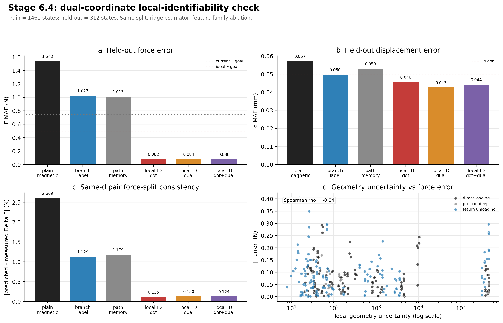

# Stage 6.4 Dual-Coordinate Local-Identifiability Check

This report uses the current accepted multi-zone dense-loop dataset without
modifying any experimental records.

## Data Split

- Training states: `1461`
- Held-out states: `312`
- Held-out sessions are excluded from training before fitting.
- Estimator: ridge regression for every model family, so this is a feature
  ablation rather than an estimator-capacity comparison.

## What Was Added

The previous local-ID model used dot projections:

```text
p_F = Delta B dot unit(j_F)
p_d = Delta B dot unit(j_d)
```

This check adds a dual-coordinate solve:

```text
[c_F, c_d]^T = (U^T U)^-1 U^T Delta B
U = [unit(j_F), unit(j_d)]
```

The dual solve estimates how much of the observed magnetic state lies along the
local force-like direction and the local displacement-like direction
simultaneously. It also records the residual fraction and a geometry confidence
score derived from angle, condition number, distance to the nearest local
sensitivity calibration, and residual fraction.

## Model Families Compared

1. Plain magnetic ridge: `B -> F,d`
2. Branch-label ridge: `B + loading/unloading/preload label -> F,d`
3. Path-memory ridge: `B + path history -> F,d`
4. Local-ID dot ridge: `B + path history + dot projections -> F,d`
5. Local-ID dual ridge: `B + path history + dual coordinates -> F,d`
6. Local-ID dot+dual ridge: `B + path history + dot + dual -> F,d`

## Key Result

- Best force MAE: `apmd_local_identifiability_dot_dual_ridge` with `F_MAE = 0.080 N`.
- Best displacement MAE: `apmd_local_identifiability_dual_ridge` with `d_MAE = 0.0426 mm`.
- Dot+dual local-ID ridge: `F_MAE = 0.080 N`,
  `d_MAE = 0.0442 mm`.
- Compared with the Lim-style branch-label baseline, dot+dual local-ID changes
  force MAE by `92.2%`.

## Metrics

| model                                     | model_family           |   train_n_states |   heldout_n_states |   F_MAE_N |   F_RMSE_N |     F_R2 |   d_MAE_mm |   d_RMSE_mm |     d_R2 |   F_MAE_vs_plain_pct |   d_MAE_vs_plain_pct |   F_MAE_vs_lim_style_pct |   d_MAE_vs_lim_style_pct |   balanced_relative_error | passes_current_F_goal   | passes_ideal_F_goal   | passes_d_goal   |
|:------------------------------------------|:-----------------------|-----------------:|-------------------:|----------:|-----------:|---------:|-----------:|------------:|---------:|---------------------:|---------------------:|-------------------------:|-------------------------:|--------------------------:|:------------------------|:----------------------|:----------------|
| apmd_local_identifiability_dot_dual_ridge | APMD local-ID dot+dual |             1461 |                312 | 0.0800605 |   0.105913 | 0.999653 |  0.0442001 |   0.0614699 | 0.990507 |              94.8077 |             22.7789  |                 92.2072  |                 11.0884  |                  0.824134 | True                    | True                  | True            |
| apmd_local_identifiability_dot_ridge      | APMD local-ID dot      |             1461 |                312 | 0.0819039 |   0.109467 | 0.99963  |  0.0456763 |   0.063029  | 0.990019 |              94.6881 |             20.1998  |                 92.0278  |                  8.11881 |                  0.851121 | True                    | True                  | True            |
| apmd_local_identifiability_dual_ridge     | APMD local-ID dual     |             1461 |                312 | 0.0836773 |   0.110062 | 0.999626 |  0.0426359 |   0.0589607 | 0.991266 |              94.5731 |             25.5116  |                 91.8552  |                 14.2348  |                  0.799153 | True                    | True                  | True            |
| apmd_path_memory_ridge                    | APMD path memory       |             1461 |                312 | 1.01344   |   1.34538  | 0.94407  |  0.0530622 |   0.0780767 | 0.984685 |              34.2734 |              7.29607 |                  1.35562 |                 -6.73841 |                  1.58431  | False                   | False                 | False           |
| lim_style_branch_ridge                    | branch-label baseline  |             1461 |                312 | 1.02737   |   1.40418  | 0.939075 |  0.0497124 |   0.0739516 | 0.98626  |              33.3702 |             13.1485  |                  0       |                  0       |                  1.53481  | False                   | False                 | True            |
| plain_magnetic_ridge                      | plain magnetic         |             1461 |                312 | 1.5419    |   2.00343  | 0.875978 |  0.0572384 |   0.0810167 | 0.98351  |               0      |              0       |                -50.0829  |                -15.139   |                  2        | False                   | False                 | False           |

## Pair Consistency

This evaluates whether the model preserves same-d loading/return force-split
structure in held-out dense-loop pairs.

| model                                     |   pair_n |   pair_delta_F_MAE_N |   pair_delta_d_MAE_mm |
|:------------------------------------------|---------:|---------------------:|----------------------:|
| apmd_local_identifiability_dot_ridge      |      144 |             0.115067 |             0.0118223 |
| apmd_local_identifiability_dot_dual_ridge |      144 |             0.124485 |             0.0127322 |
| apmd_local_identifiability_dual_ridge     |      144 |             0.13003  |             0.013497  |
| lim_style_branch_ridge                    |      144 |             1.12925  |             0.02639   |
| apmd_path_memory_ridge                    |      144 |             1.17931  |             0.0289514 |
| plain_magnetic_ridge                      |      144 |             2.60909  |             0.0585557 |

## Geometry Confidence

Positive correlation with error means the confidence/uncertainty feature is
useful as a warning flag; weak correlation means it is mostly descriptive.

| model                                     | feature                      |   spearman_abs_F_error |   spearman_abs_d_error |   n |
|:------------------------------------------|:-----------------------------|-----------------------:|-----------------------:|----:|
| apmd_local_identifiability_dot_dual_ridge | local_geometry_confidence    |            0.0427616   |              -0.211488 | 312 |
| apmd_local_identifiability_dot_dual_ridge | local_geometry_uncertainty   |           -0.0427616   |               0.211488 | 312 |
| apmd_local_identifiability_dot_dual_ridge | local_dual_residual_fraction |           -0.107181    |               0.188978 | 312 |
| apmd_local_identifiability_dot_ridge      | local_geometry_confidence    |            0.0124022   |              -0.189594 | 312 |
| apmd_local_identifiability_dot_ridge      | local_geometry_uncertainty   |           -0.0124022   |               0.189594 | 312 |
| apmd_local_identifiability_dot_ridge      | local_dual_residual_fraction |           -0.0805467   |               0.169333 | 312 |
| apmd_local_identifiability_dual_ridge     | local_geometry_confidence    |            0.0562812   |              -0.215068 | 312 |
| apmd_local_identifiability_dual_ridge     | local_geometry_uncertainty   |           -0.0562812   |               0.215068 | 312 |
| apmd_local_identifiability_dual_ridge     | local_dual_residual_fraction |           -0.0787694   |               0.186305 | 312 |
| apmd_path_memory_ridge                    | local_geometry_confidence    |            0.0144465   |              -0.200025 | 312 |
| apmd_path_memory_ridge                    | local_geometry_uncertainty   |           -0.0144465   |               0.200025 | 312 |
| apmd_path_memory_ridge                    | local_dual_residual_fraction |            0.0293791   |               0.351657 | 312 |
| lim_style_branch_ridge                    | local_geometry_confidence    |            0.000281716 |              -0.203694 | 312 |
| lim_style_branch_ridge                    | local_geometry_uncertainty   |           -0.000281716 |               0.203694 | 312 |
| lim_style_branch_ridge                    | local_dual_residual_fraction |            0.175526    |               0.357148 | 312 |
| plain_magnetic_ridge                      | local_geometry_confidence    |           -0.104722    |              -0.264068 | 312 |
| plain_magnetic_ridge                      | local_geometry_uncertainty   |            0.104722    |               0.264068 | 312 |
| plain_magnetic_ridge                      | local_dual_residual_fraction |            0.24048     |               0.383249 | 312 |

## Figure



## Interpretation

The dual-coordinate model is not a new experiment. It is a stricter test of the
APMD claim that actively measured local `j_F/j_d` geometry can be used as a
model coordinate. If the dual or dot+dual feature family outperforms plain
magnetic and branch-label baselines on the same held-out sessions, then the
benefit comes from local response geometry rather than merely giving the model a
loading/unloading label.
