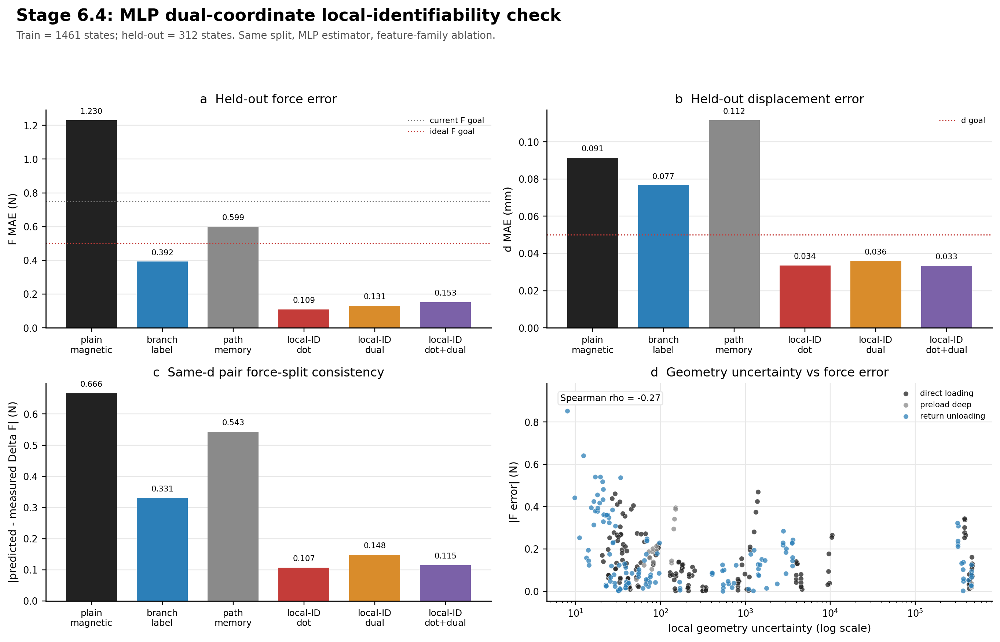

# Stage 6.4 MLP Dual-Coordinate Local-Identifiability Check

This report uses the current accepted multi-zone dense-loop dataset without
modifying any experimental records.

## Data Split

- Training states: `1461`
- Held-out states: `312`
- Held-out sessions are excluded from training before fitting.
- Estimator: small tabular MLP for every model family, so this is an
  estimator-capacity check using the same feature-family ablation as the ridge
  Stage 6.4 figure.

## Model Families Compared

1. Plain magnetic MLP: `B -> F,d`
2. Branch-label MLP: `B + loading/unloading/preload label -> F,d`
3. Path-memory MLP: `B + path history -> F,d`
4. Local-ID dot MLP: `B + path history + dot projections -> F,d`
5. Local-ID dual MLP: `B + path history + dual coordinates -> F,d`
6. Local-ID dot+dual MLP: `B + path history + dot + dual -> F,d`

## Key Result

- Best force MAE: `apmd_local_identifiability_dot_mlp` with `F_MAE = 0.109 N`.
- Best displacement MAE: `apmd_local_identifiability_dot_dual_mlp` with `d_MAE = 0.0333 mm`.
- Dot+dual local-ID MLP: `F_MAE = 0.153 N`,
  `d_MAE = 0.0333 mm`.
- Compared with the Lim-style branch-label MLP baseline, dot+dual local-ID
  changes force MAE by `60.9%`.
- Ridge dot+dual reference: `F_MAE = 0.080 N`, `d_MAE = 0.0442 mm`.

## Metrics

| model                                   | model_family           |   train_n_states |   heldout_n_states |   F_MAE_N |   F_RMSE_N |     F_R2 |   d_MAE_mm |   d_RMSE_mm |     d_R2 |   F_MAE_vs_plain_mlp_pct |   d_MAE_vs_plain_mlp_pct |   F_MAE_vs_lim_style_mlp_pct |   d_MAE_vs_lim_style_mlp_pct | passes_current_F_goal   | passes_ideal_F_goal   | passes_d_goal   |
|:----------------------------------------|:-----------------------|-----------------:|-------------------:|----------:|-----------:|---------:|-----------:|------------:|---------:|-------------------------:|-------------------------:|-----------------------------:|-----------------------------:|:------------------------|:----------------------|:----------------|
| apmd_local_identifiability_dot_mlp      | APMD local-ID dot      |             1461 |                312 |  0.109298 |   0.150324 | 0.999302 |  0.0335401 |   0.0410948 | 0.995757 |                  91.1142 |                  63.3344 |                      72.1392 |                      56.1809 | True                    | True                  | True            |
| apmd_local_identifiability_dual_mlp     | APMD local-ID dual     |             1461 |                312 |  0.130784 |   0.184138 | 0.998952 |  0.0359803 |   0.0466783 | 0.994526 |                  89.3675 |                  60.6668 |                      66.6624 |                      52.9928 | True                    | True                  | True            |
| apmd_local_identifiability_dot_dual_mlp | APMD local-ID dot+dual |             1461 |                312 |  0.153284 |   0.209344 | 0.998646 |  0.0332639 |   0.0397905 | 0.996022 |                  87.5383 |                  63.6363 |                      60.9271 |                      56.5417 | True                    | True                  | True            |
| lim_style_branch_mlp                    | branch-label baseline  |             1461 |                312 |  0.392301 |   0.724764 | 0.983769 |  0.0765421 |   0.127441  | 0.959196 |                  68.1066 |                  16.325  |                       0      |                       0      | True                    | True                  | False           |
| apmd_path_memory_mlp                    | APMD path memory       |             1461 |                312 |  0.599148 |   0.920108 | 0.97384  |  0.111561  |   0.124692  | 0.960938 |                  51.2903 |                 -21.9575 |                     -52.7264 |                     -45.7515 | True                    | False                 | False           |
| plain_magnetic_mlp                      | plain magnetic         |             1461 |                312 |  1.23004  |   3.14402  | 0.694562 |  0.0914755 |   0.162526  | 0.933637 |                   0      |                   0      |                    -213.544  |                     -19.5101 | False                   | False                 | False           |

## Pair Consistency

This evaluates whether the model preserves same-d loading/return force-split
structure in held-out dense-loop pairs.

| model                                   |   pair_n |   pair_delta_F_MAE_N |   pair_delta_d_MAE_mm |
|:----------------------------------------|---------:|---------------------:|----------------------:|
| apmd_local_identifiability_dot_mlp      |      144 |             0.107069 |             0.020729  |
| apmd_local_identifiability_dot_dual_mlp |      144 |             0.115113 |             0.038181  |
| apmd_local_identifiability_dual_mlp     |      144 |             0.148223 |             0.0185809 |
| lim_style_branch_mlp                    |      144 |             0.330821 |             0.0371748 |
| apmd_path_memory_mlp                    |      144 |             0.543313 |             0.0406212 |
| plain_magnetic_mlp                      |      144 |             0.666199 |             0.0261435 |

## Geometry Confidence

Positive correlation with error means the confidence/uncertainty feature is
useful as a warning flag; weak correlation means it is mostly descriptive.

| model                                   | feature                      |   spearman_abs_F_error |   spearman_abs_d_error |   n |
|:----------------------------------------|:-----------------------------|-----------------------:|-----------------------:|----:|
| apmd_local_identifiability_dot_dual_mlp | local_geometry_confidence    |              0.273646  |              -0.138269 | 312 |
| apmd_local_identifiability_dot_dual_mlp | local_geometry_uncertainty   |             -0.273646  |               0.138269 | 312 |
| apmd_local_identifiability_dot_dual_mlp | local_dual_residual_fraction |             -0.156839  |               0.243999 | 312 |
| apmd_local_identifiability_dot_mlp      | local_geometry_confidence    |              0.239287  |              -0.292502 | 312 |
| apmd_local_identifiability_dot_mlp      | local_geometry_uncertainty   |             -0.239287  |               0.292502 | 312 |
| apmd_local_identifiability_dot_mlp      | local_dual_residual_fraction |             -0.235385  |               0.358273 | 312 |
| apmd_local_identifiability_dual_mlp     | local_geometry_confidence    |              0.403022  |              -0.190436 | 312 |
| apmd_local_identifiability_dual_mlp     | local_geometry_uncertainty   |             -0.403022  |               0.190436 | 312 |
| apmd_local_identifiability_dual_mlp     | local_dual_residual_fraction |             -0.381994  |               0.25379  | 312 |
| apmd_path_memory_mlp                    | local_geometry_confidence    |              0.151108  |               0.279717 | 312 |
| apmd_path_memory_mlp                    | local_geometry_uncertainty   |             -0.151108  |              -0.279717 | 312 |
| apmd_path_memory_mlp                    | local_dual_residual_fraction |              0.0475689 |              -0.152147 | 312 |
| lim_style_branch_mlp                    | local_geometry_confidence    |             -0.229464  |              -0.206797 | 312 |
| lim_style_branch_mlp                    | local_geometry_uncertainty   |              0.229464  |               0.206797 | 312 |
| lim_style_branch_mlp                    | local_dual_residual_fraction |              0.326599  |               0.30456  | 312 |
| plain_magnetic_mlp                      | local_geometry_confidence    |              0.117656  |              -0.166834 | 312 |
| plain_magnetic_mlp                      | local_geometry_uncertainty   |             -0.117656  |               0.166834 | 312 |
| plain_magnetic_mlp                      | local_dual_residual_fraction |             -0.0523838 |               0.161626 | 312 |

## Figure

## Interpretation

This MLP check answers whether the local-ID feature advantage is only an artifact
of linear ridge regression. If local-ID MLP still outperforms plain magnetic and
branch-label MLP on the same held-out sessions, then the active-path local
geometry remains useful even when the estimator has nonlinear capacity.
