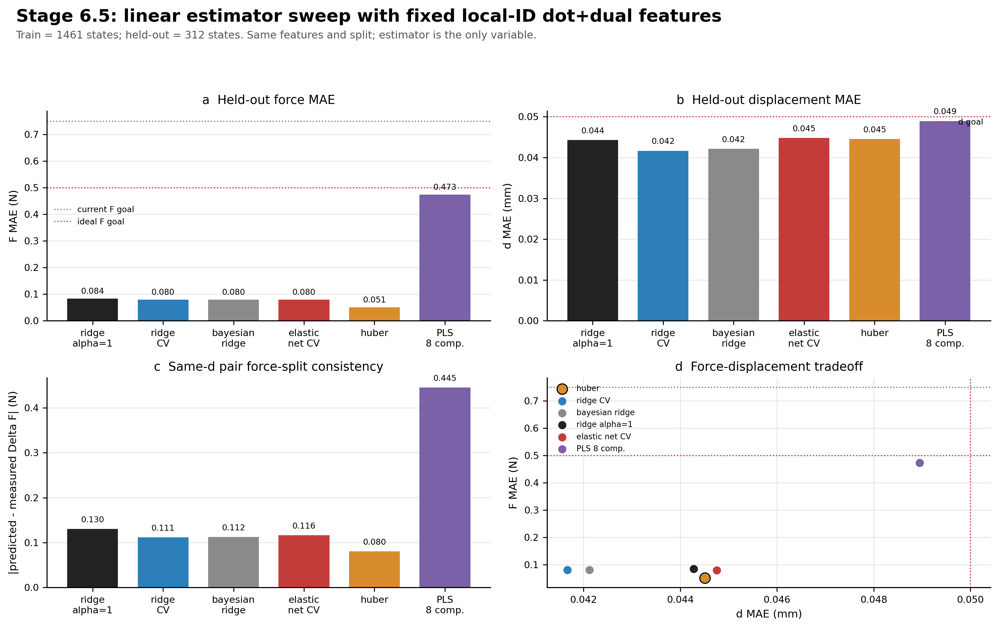
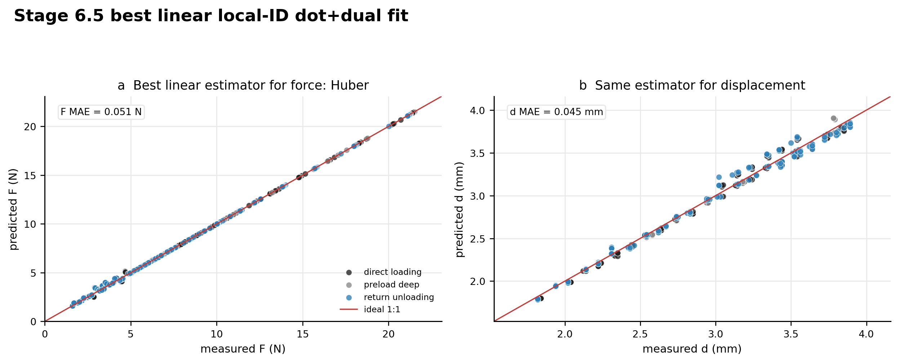

# Stage 6.5 Linear Estimator Sweep

This report keeps the Stage 6.4 multi-zone accepted train/held-out split and
the same APMD local-ID dot+dual features.  It changes only the linear estimator.

## Data Split

- Training states: `1461`
- Held-out states: `312`
- Feature family: `B + path history + local-ID dot projections + local-ID dual coordinates`
- Held-out sessions are excluded from training before fitting.

## Why This Check Was Needed

Ridge regression had been the strongest stable baseline, but ridge is only one
linear regularized estimator.  This sweep asks whether another linear estimator
can give a better force/displacement tradeoff without changing the APMD feature
logic.

## Estimators Compared

1. Ridge, fixed `alpha=1.0`
2. RidgeCV over log-spaced alphas
3. BayesianRidge, wrapped as a multi-output model
4. ElasticNetCV, wrapped as a multi-output model
5. HuberRegressor, wrapped as a multi-output robust model
6. PLSRegression with 8 components

## Key Result

- Best balanced estimator: `Huber` with
  `F_MAE = 0.051 N`,
  `d_MAE = 0.0445 mm`.
- Best force estimator: `Huber` with
  `F_MAE = 0.051 N`.
- Best displacement estimator: `RidgeCV` with
  `d_MAE = 0.0417 mm`.
- Ridge alpha=1 reference:
  `F_MAE = 0.084 N`,
  `d_MAE = 0.0443 mm`.

## Metrics

| model          | estimator     | model_family           |   train_n_states |   heldout_n_states |   F_MAE_N |   F_RMSE_N |     F_R2 |   d_MAE_mm |   d_RMSE_mm |     d_R2 | passes_current_F_goal   | passes_ideal_F_goal   | passes_d_goal   |   balanced_score_ideal |
|:---------------|:--------------|:-----------------------|-----------------:|-------------------:|----------:|-----------:|---------:|-----------:|------------:|---------:|:------------------------|:----------------------|:----------------|-----------------------:|
| huber          | Huber         | APMD local-ID dot+dual |             1461 |                312 | 0.0508342 |   0.130313 | 0.999475 |  0.0445086 |   0.0567663 | 0.991904 | True                    | True                  | True            |               0.99184  |
| ridge_cv       | RidgeCV       | APMD local-ID dot+dual |             1461 |                312 | 0.0799416 |   0.120581 | 0.999551 |  0.0416639 |   0.0562879 | 0.99204  | True                    | True                  | True            |               0.993162 |
| bayesian_ridge | BayesianRidge | APMD local-ID dot+dual |             1461 |                312 | 0.080059  |   0.125955 | 0.99951  |  0.0421183 |   0.0569402 | 0.991854 | True                    | True                  | True            |               1.00248  |
| ridge_alpha1   | Ridge alpha=1 | APMD local-ID dot+dual |             1461 |                312 | 0.0837741 |   0.110271 | 0.999624 |  0.0442768 |   0.0615622 | 0.990478 | True                    | True                  | True            |               1.05308  |
| elastic_net_cv | ElasticNetCV  | APMD local-ID dot+dual |             1461 |                312 | 0.0797517 |   0.104391 | 0.999663 |  0.0447544 |   0.0609757 | 0.990659 | True                    | True                  | True            |               1.05459  |
| pls8           | PLS 8 comp.   | APMD local-ID dot+dual |             1461 |                312 | 0.473242  |   0.621186 | 0.988077 |  0.0489507 |   0.0589461 | 0.99127  | True                    | True                  | True            |               1.9255   |

## Same-d Pair Consistency

This checks whether the estimator preserves the measured loading/return
force-split structure within same-d held-out dense-loop pairs.

| model          |   pair_n |   pair_delta_F_MAE_N |   pair_delta_d_MAE_mm |
|:---------------|---------:|---------------------:|----------------------:|
| huber          |      144 |            0.0802973 |             0.0150252 |
| ridge_cv       |      144 |            0.111378  |             0.0132065 |
| bayesian_ridge |      144 |            0.112469  |             0.0128122 |
| elastic_net_cv |      144 |            0.116131  |             0.0152468 |
| ridge_alpha1   |      144 |            0.130303  |             0.0127961 |
| pls8           |      144 |            0.44474   |             0.0315912 |

## Figures

## Interpretation

This is an estimator-selection check, not a new mechanism claim.  If one of the
linear alternatives beats fixed ridge, it can be used as the cleaner baseline
for the current local-ID model.  If fixed ridge remains near-optimal, then the
main performance gain is more likely coming from the APMD local-ID feature
coordinates rather than from estimator tuning.
