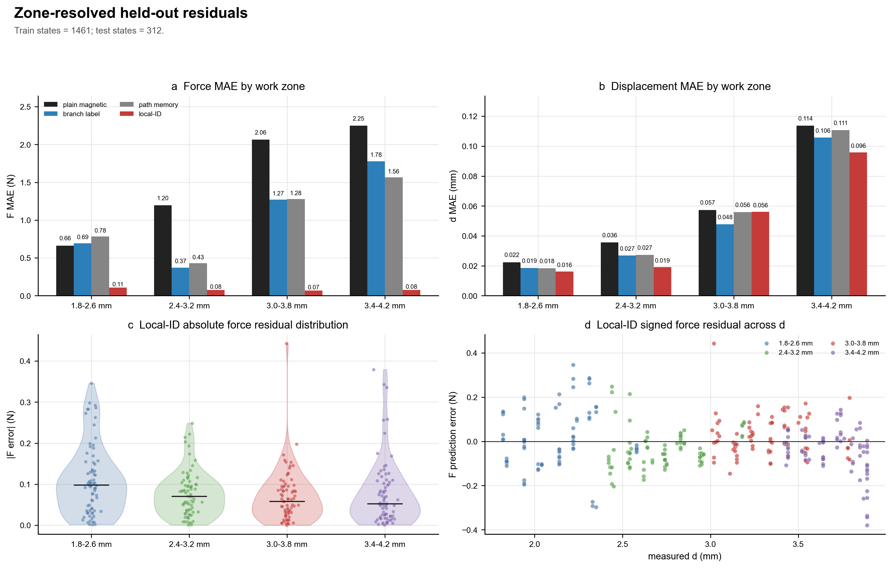
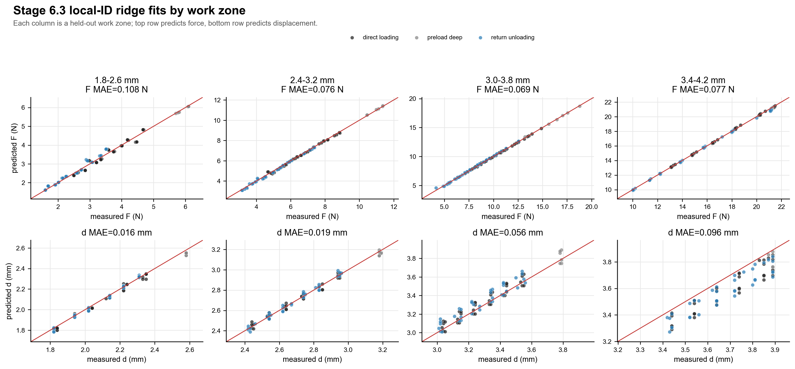

# Stage 6.3 Work-Zone Residual Analysis

This analysis reuses the existing Stage 6.3 ridge held-out prediction table:

```text
C:/Users/zhang/OneDrive - University of Virginia/桌面/AIME/Research/磁解耦/mlx90393_python/reports/apmd_stage6_local_identifiability_predictions.csv
```

No model was refit and no experimental record was changed.  The purpose is to
split the same held-out predictions by dense-loop work zone and identify where
the local-ID ridge model is reliable or weak.

## Work-Zone Definition

The split uses the held-out session protocol, not the nearest local sensitivity
ID:

| Work zone | Source protocol |
|---|---|
| 1.8-2.6 mm | shallow held-out dense-loop sessions |
| 2.4-3.2 mm | lower held-out dense-loop sessions |
| 3.0-3.8 mm | original mid held-out dense-loop sessions |
| 3.4-4.2 mm | upper held-out dense-loop sessions |

Each zone contributes `78` local-ID held-out states.

## Local-ID Ridge Summary

Best force zone: `3.0-3.8 mm` with `F_MAE = 0.069 N`.

Worst force zone: `1.8-2.6 mm` with `F_MAE = 0.108 N`.

Best displacement zone: `1.8-2.6 mm` with `d_MAE = 0.016 mm`.

Worst displacement zone: `3.4-4.2 mm` with `d_MAE = 0.096 mm`.

## Local-ID Ridge Metrics by Zone

| work_zone   | model                            | model_label   |   n_states |   n_sessions |   actual_d_min_mm |   actual_d_max_mm |   F_min_N |   F_max_N |   F_MAE_N |   F_RMSE_N |     F_R2 |   d_MAE_mm |   d_RMSE_mm |     d_R2 |   F_error_median_N |   d_error_median_mm |   F_abs_error_p90_N |   d_abs_error_p90_mm |
|:------------|:---------------------------------|:--------------|-----------:|-------------:|------------------:|------------------:|----------:|----------:|----------:|-----------:|---------:|-----------:|------------:|---------:|-------------------:|--------------------:|--------------------:|---------------------:|
| 1.8-2.6 mm  | apmd_local_identifiability_ridge | local-ID      |         78 |            2 |              1.82 |              2.58 |   1.59155 |   6.09725 | 0.108214  |  0.13665   | 0.98505  |  0.0160773 |   0.0207042 | 0.990245 |       -0.000341033 |         -0.00630427 |            0.250177 |            0.0331271 |
| 2.4-3.2 mm  | apmd_local_identifiability_ridge | local-ID      |         78 |            3 |              2.42 |              3.19 |   3.1511  |  11.3635  | 0.0763061 |  0.0935261 | 0.997801 |  0.0190903 |   0.0233046 | 0.987935 |       -0.0543345   |          0.00457332 |            0.137426 |            0.0392859 |
| 3.0-3.8 mm  | apmd_local_identifiability_ridge | local-ID      |         78 |            2 |              3.01 |              3.79 |   4.1544  |  18.7804  | 0.0685363 |  0.0931912 | 0.999105 |  0.0560798 |   0.0675002 | 0.898342 |        0.00306722  |          0.0462944  |            0.140894 |            0.108227  |
| 3.4-4.2 mm  | apmd_local_identifiability_ridge | local-ID      |         78 |            2 |              3.42 |              3.89 |  10.0087  |  21.4931  | 0.0765157 |  0.110126  | 0.999097 |  0.0957866 |   0.111865  | 0.522076 |       -0.0259367   |         -0.103274   |            0.153152 |            0.16614   |

## All Ridge Model Metrics by Zone

| work_zone   | model                            | model_label    |   n_states |   n_sessions |   actual_d_min_mm |   actual_d_max_mm |   F_min_N |   F_max_N |   F_MAE_N |   F_RMSE_N |     F_R2 |   d_MAE_mm |   d_RMSE_mm |     d_R2 |   F_error_median_N |   d_error_median_mm |   F_abs_error_p90_N |   d_abs_error_p90_mm |
|:------------|:---------------------------------|:---------------|-----------:|-------------:|------------------:|------------------:|----------:|----------:|----------:|-----------:|---------:|-----------:|------------:|---------:|-------------------:|--------------------:|--------------------:|---------------------:|
| 1.8-2.6 mm  | apmd_local_identifiability_ridge | local-ID       |         78 |            2 |              1.82 |              2.58 |   1.59155 |   6.09725 | 0.108214  |  0.13665   | 0.98505  |  0.0160773 |   0.0207042 | 0.990245 |       -0.000341033 |        -0.00630427  |            0.250177 |            0.0331271 |
| 1.8-2.6 mm  | apmd_path_memory_ridge           | path memory    |         78 |            2 |              1.82 |              2.58 |   1.59155 |   6.09725 | 0.783019  |  0.956784  | 0.267086 |  0.018393  |   0.0232767 | 0.98767  |        0.260939    |        -0.0037081   |            1.51702  |            0.04155   |
| 1.8-2.6 mm  | lim_style_branch_ridge           | branch label   |         78 |            2 |              1.82 |              2.58 |   1.59155 |   6.09725 | 0.69168   |  0.831924  | 0.445893 |  0.0185437 |   0.0239522 | 0.986944 |       -0.160638    |        -0.0028747   |            1.25519  |            0.037828  |
| 1.8-2.6 mm  | plain_magnetic_ridge             | plain magnetic |         78 |            2 |              1.82 |              2.58 |   1.59155 |   6.09725 | 0.662374  |  0.795133  | 0.493819 |  0.0223784 |   0.0271185 | 0.983264 |       -0.473134    |        -0.0118928   |            1.28008  |            0.0411789 |
| 2.4-3.2 mm  | apmd_local_identifiability_ridge | local-ID       |         78 |            3 |              2.42 |              3.19 |   3.1511  |  11.3635  | 0.0763061 |  0.0935261 | 0.997801 |  0.0190903 |   0.0233046 | 0.987935 |       -0.0543345   |         0.00457332  |            0.137426 |            0.0392859 |
| 2.4-3.2 mm  | apmd_path_memory_ridge           | path memory    |         78 |            3 |              2.42 |              3.19 |   3.1511  |  11.3635  | 0.428954  |  0.545767  | 0.925126 |  0.0272956 |   0.034654  | 0.973322 |        0.229088    |        -0.00348698  |            0.968418 |            0.0589078 |
| 2.4-3.2 mm  | lim_style_branch_ridge           | branch label   |         78 |            3 |              2.42 |              3.19 |   3.1511  |  11.3635  | 0.371127  |  0.433179  | 0.952832 |  0.0268102 |   0.0331592 | 0.975574 |        0.328803    |         0.000318418 |            0.710178 |            0.0536681 |
| 2.4-3.2 mm  | plain_magnetic_ridge             | plain magnetic |         78 |            3 |              2.42 |              3.19 |   3.1511  |  11.3635  | 1.19511   |  1.36428   | 0.532134 |  0.0355909 |   0.0439151 | 0.957157 |       -0.493406    |        -0.000453475 |            2.09229  |            0.0722796 |
| 3.0-3.8 mm  | apmd_local_identifiability_ridge | local-ID       |         78 |            2 |              3.01 |              3.79 |   4.1544  |  18.7804  | 0.0685363 |  0.0931912 | 0.999105 |  0.0560798 |   0.0675002 | 0.898342 |        0.00306722  |         0.0462944   |            0.140894 |            0.108227  |
| 3.0-3.8 mm  | apmd_path_memory_ridge           | path memory    |         78 |            2 |              3.01 |              3.79 |   4.1544  |  18.7804  | 1.27863   |  1.63844   | 0.72339  |  0.0558693 |   0.0672981 | 0.898949 |        0.911173    |         0.0533048   |            2.34417  |            0.113248  |
| 3.0-3.8 mm  | lim_style_branch_ridge           | branch label   |         78 |            2 |              3.01 |              3.79 |   4.1544  |  18.7804  | 1.26921   |  1.56199   | 0.748601 |  0.0478148 |   0.0584931 | 0.923662 |        0.777875    |         0.0411661   |            2.47047  |            0.092934  |
| 3.0-3.8 mm  | plain_magnetic_ridge             | plain magnetic |         78 |            2 |              3.01 |              3.79 |   4.1544  |  18.7804  | 2.06258   |  2.52027   | 0.345511 |  0.0573582 |   0.0732965 | 0.880133 |        0.465388    |         0.0558317   |            3.92293  |            0.117112  |
| 3.4-4.2 mm  | apmd_local_identifiability_ridge | local-ID       |         78 |            2 |              3.42 |              3.89 |  10.0087  |  21.4931  | 0.0765157 |  0.110126  | 0.999097 |  0.0957866 |   0.111865  | 0.522076 |       -0.0259367   |        -0.103274    |            0.153152 |            0.16614   |
| 3.4-4.2 mm  | apmd_path_memory_ridge           | path memory    |         78 |            2 |              3.42 |              3.89 |  10.0087  |  21.4931  | 1.56315   |  1.82823   | 0.751183 |  0.110691  |   0.134581  | 0.308269 |        0.455237    |        -0.127957    |            2.94227  |            0.200101  |
| 3.4-4.2 mm  | lim_style_branch_ridge           | branch label   |         78 |            2 |              3.42 |              3.89 |  10.0087  |  21.4931  | 1.77744   |  2.13714   | 0.659998 |  0.105681  |   0.12954   | 0.35912  |        0.35563     |        -0.101914    |            3.85294  |            0.196121  |
| 3.4-4.2 mm  | plain_magnetic_ridge             | plain magnetic |         78 |            2 |              3.42 |              3.89 |  10.0087  |  21.4931  | 2.24754   |  2.68507   | 0.463305 |  0.113626  |   0.134976  | 0.304206 |       -0.347003    |        -0.0885541   |            4.27213  |            0.217026  |

## Same-d Pair Consistency by Zone

| work_zone   | model                            |   n_pairs |   pair_delta_F_MAE_N |   pair_delta_d_MAE_mm |
|:------------|:---------------------------------|----------:|---------------------:|----------------------:|
| 1.8-2.6 mm  | apmd_local_identifiability_ridge |        36 |            0.191507  |            0.0149028  |
| 2.4-3.2 mm  | apmd_local_identifiability_ridge |        36 |            0.0862398 |            0.0119585  |
| 3.0-3.8 mm  | apmd_local_identifiability_ridge |        36 |            0.106816  |            0.0190184  |
| 3.4-4.2 mm  | apmd_local_identifiability_ridge |        36 |            0.0716394 |            0.00800798 |

## Figures





## Interpretation

This zone-level view should be read as an applicability-map check.  The global
Stage 6.3 result shows that local-ID features strongly improve force
decoupling overall, but the residual distribution reveals which work zones are
already robust and which zones remain boundary or calibration-limited.  This is
the right basis for deciding whether the next experiment should add more
dense-loop states, more same-d force-sensitivity pairs, or missing same-F
displacement-sensitivity information in a specific work zone.
